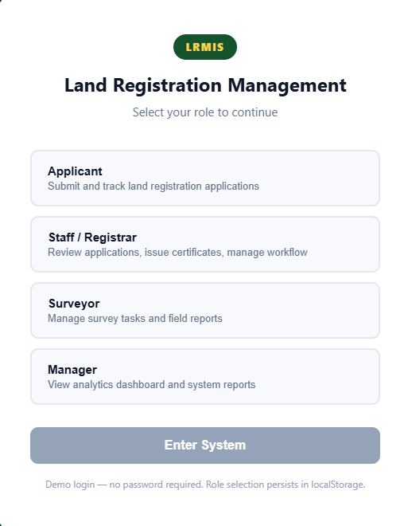
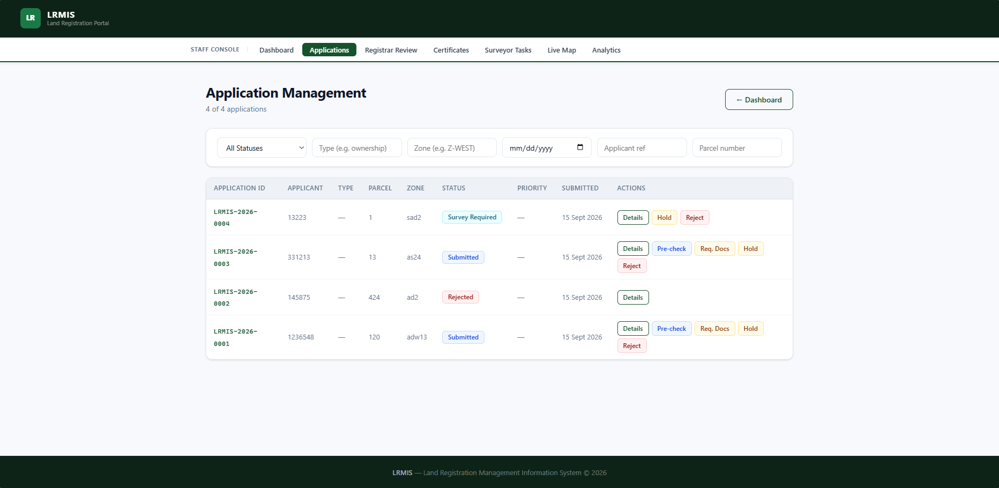
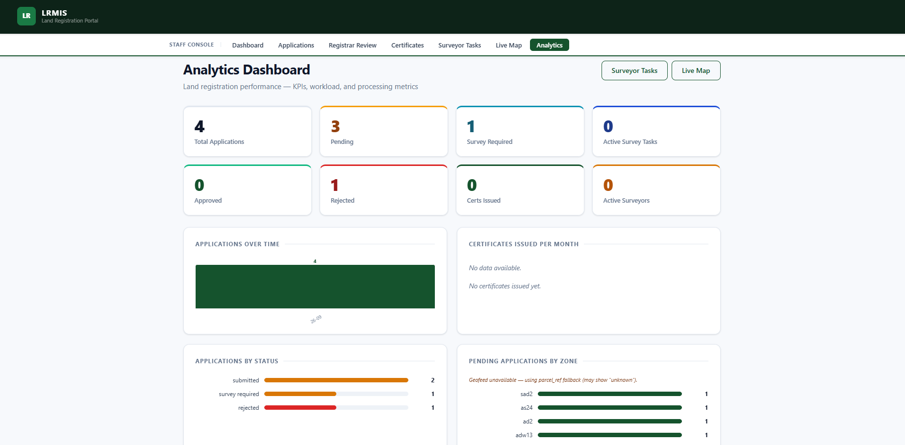

# LRMIS — Land Registration Management Information System

LRMIS is a full-stack land registration management platform designed to digitize and manage the complete lifecycle of land registration applications.

The system provides a centralized workspace for applicants, registrars, surveyors, and managers to handle applications, documents, surveys, certificates, geographic data, and operational reporting.

The platform manages the workflow from the initial application submission until approval and certificate issuance.

## Overview

LRMIS provides different modules for different users involved in the land registration process.

The system includes:
- Applicant application submission
- Application tracking and workflow management
- Document upload and verification
- Registrar review process
- Survey task management
- Certificate generation
- GIS visualization
- Analytics and reporting
- Role-based access
   
## Main Workflows

The application follows a structured registration workflow:

```text
Application Submitted
        |
        v
Document Review
        |
        v
Pre-Check
        |
        v
Survey Required
        |
        v
Survey Completed
        |
        v
Registrar Review
        |
        v
Approved
        |
        v
Certificate Issued
```

## User Roles

### Applicant

Applicants can:

- Submit land registration applications
- Upload required documents
- Track application progress
- View application status
- Submit objections when required


### Staff / Registrar

Registrars manage the official registration workflow.

Features include:

- Review applications
- Validate submitted documents
- Request missing documents
- Change application status
- Approve or reject applications
- Issue certificates


### Surveyor

Surveyors handle field verification tasks.

Features include:

- View assigned survey tasks
- Update survey progress
- Submit survey reports
- Manage field activities


### Manager

Managers have access to:

- Analytics dashboard
- System reports
- Registration statistics
- Performance monitoring


## Application Preview

### Role Selection

The system starts with a role-based entry screen where users select their working area.

Available roles:

- Applicant
- Staff / Registrar
- Surveyor
- Manager




### Application Management

The Staff Console provides a centralized interface for managing registration applications.

The application management screen supports:

- Viewing submitted applications
- Filtering applications
- Tracking workflow status
- Reviewing application details
- Performing workflow actions




### Analytics Dashboard

The Analytics Dashboard provides operational insights into the registration process.

It displays:

- Total applications
- Pending applications
- Survey requirements
- Approved applications
- Rejected applications
- Certificate statistics
- Application trends
- Applications by zone




## System Architecture

LRMIS consists of three main layers:

```text
React / Vite
Frontend
      |
      v
REST API
      |
      v
FastAPI
Backend
      |
      v
MongoDB
Database
```

## Backend

The FastAPI backend handles:

- Application logic
- Workflow transitions
- User operations
- Document management
- Certificate processing
- Analytics APIs

## Frontend

The React frontend provides:

- Role-based interfaces
- Application screens
- Dashboards
- Workflow actions
- GIS views


## Technologies

- Python
- FastAPI
- MongoDB
- React
- Vite
- JavaScript
- REST APIs
- GeoJSON
- Docker


## Running the Project

### Backend

```bash
cd backend

uvicorn app.main:app --reload
```


### Frontend

```bash
cd frontend

npm install

npm run dev
```


## Key Features

This project demonstrates:

- Full-stack application development
- Workflow-based systems
- REST API design
- Database-driven applications
- Role-based access control
- GIS integration
- Analytics dashboards
- Frontend/backend communication


## Security

Sensitive information should not be committed to the repository.

Environment variables should be used for:

- Database credentials
- Authentication secrets
- External service configuration